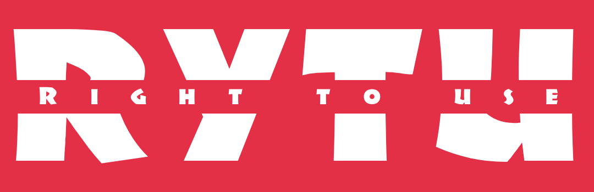

<a name="readme-top"></a>

<br />
<div align="center">
  <a href="https://github.com/codeEzzy/lightlink">
    
  </a>

  <h3 align="center">The Right to Use (RYTU) Marketplace App</h3>

</div>

## Summary
The article discusses Universal Music Group's decision to remove its music from TikTok and the broader challenge of using copyrighted work. It introduces Right To Use (RYTU), a web3-based solution that allows copyright holders to grant the "right to use" their work through minting RYTU NFTs. The article highlights the platform's importance in providing flexible terms for copyright usage and its potential to revolutionize copyright distribution globally. It outlines the features of the RYTU marketplace, its business model including transaction and royalty fees, personal NFT collections, verification services, and advertisement revenue. The roadmap includes plans for a Chrome extension, NFT Image Generator, and commitments from team members to distribute their RYTU NFTs.

### Screenshots to represent the project


## Live demo
[Click to view](https://particle-rytu.netlify.app/)


## Overview
[Universal Music Group shocked the world when its decision to pull all its music from TikTok](https://www.forbes.com/sites/ariannajohnson/2024/01/31/will-tiktok-videos-be-muted-heres-what-to-know-after-licensing-deal-with-universal-music-ends/?sh=22ce8d40537c) , a popular social media platform, hit the internet - effective on the 31st of Jan, 2024. Although this came as a surprise to many, as most videos on TikTok will now become mute, it is only a part of an age-long challenge with using copyrighted work.

Imagine a world where people can obtain the "Right to Use" a copyrighted work on flexible terms and for an agreed duration and price, which is also publicly verifiable. Never has there been a more suitable time where the "Right to Use" a research thesis, music piece, a stock photo, etc., can be authorized by the copyright holder with ease, at a profit, and for anyone.

Right To Use (RYTU) is a web3-based solution with real-world importance and urgency. The RYTU marketplace is a platform that allows copyright holders to give out the "right to use" their copyrighted work under specified and flexible criteria (e.g., duration, price, etc.) with ease by minting RYTU NFTs. This makes it easier to obtain an RYTU NFT, and a holder's claim on the right to use a copyrighted work is publicly verifiable.

The RYTU marketplace is just what the world needs right now. From the growing research/software/digital arts in North America to the Game development boom in Asia, all the way to the vibrant Afrobeat/Amapiano music in Africa, copyright holders now have a decentralized way of distributing the "Right to Use" their work on their terms, to everyone, and at a profit.

**Hackathon Solution:**
The solution currently:
- Seamless User Onboarding: Integration with Particle Network for smooth authentication and onboarding, enhancing accessibility
- Intuitive User Interface & Experience: Designed for ease of use, with a streamlined interface to engage a broad user base
- Landing page 
- ⁠RYTU (NFT) explorer marketplace 
- ⁠Ownership Verification Certification
- ⁠Requesting a RYTU from a creator
- ⁠Negotiating new RYTU terms and conditions with IP owner

**Business Model:**
- Transaction Fees: RYTU marketplace has a transaction fee ($1 and 3.5% for amounts greater than $70 - subject to change) in addition to the Lightlink $1 transaction fee.
- Royalty Fees: An optional royalty fee may apply (to benefit copyright holders).
- Personal NFT Collections: Currently, all copyright holders can create their NFTs under RYTU's public collections (RYTU-ERC721 and RYTU-ERC1155). However, for a fee, RYTU will create a personal collection for a copyright holder.
- Verification Service: RYTU will verify users and consequently their NFTs at a price, to ensure their unlockable content is valid.
- Advertisement Revenue: RYTU marketplace's home banner will also be monetized and open for advertisement.

**Roadmap:**
- Allows copyright holders to create RYTU NFTs (both ERC-721 and ERC-1155 Standards).
- Allows users to bid for a RYTU NFT.
- Provides unlockable content (which often will be the real-world asset associated with the RYTU NFT).
- Chrome extension: RYTU marketplace will have a Chrome extension (the provision for download is currently on the home page). This Chrome extension is crucial in its ecosystem as it will be a shopping cart, wallet, single-sign-on, metaverse profile, notification, and payment (fiat to token using RYTU Token) widget.
- NFT Image Generator: users should be able to generate NFT images from prompts and then proceed to mint.
- Putting our money where my mouth is: On our team, we have a developer who is also a singer/songwriter. He and several songwriters have already decided to distribute their RYTU NFTs on the platform right after launch, as this is a step in the right direction for creatives.
- Tokenomics

## Features included

The Right to Use Marketplace  includes the following features:

- Open collections (User-generated content)
  - Mint ERC-721
  - Mint ERC-1155
  - Creator's royalties support
- Homepage content customization
  - Featured NFTs
  - Custom section with featured elements
- Search system
  - Search NFTs
  - Search collections
  - Search users
- Explore NFTs, collections and users with filtering and sorting systems
  - Explore NFTs
    - Filter by chain
    - Filter by status
    - Filter by price
    - Filter by collection
    - Filter by traits
    - Sort by dates
  - Explore collections
    - Filter by chain
    - Sort by volumes
  - Explore users
- Native currency and ERC20 support
- Lazymint for NFTs
- List NFTs on sale
  - Partial filling
  - Fixed price listing
- Make offers on NFTs
  - Partial filling
  - Open offer
- Purchase NFTs
- User profile
  - Account
    - Profile edition
    - Wallet page
  - NFTs "on sale"
  - NFTs "owned"
  - NFTs "created"
  - Offers ("bids") management
  - Trades history
  - Listings ("offers") management
- User verification system (verified status)

- NFT details
  - Chain information
  - Explorer link
  - Media IPFS link
  - Metadata IPFS link
  - Traits with percentages
- NFT history (activity)
  - Lazyminted
  - Minted
  - Listed
  - Purchased
  - Transferred
- Wallet connection with
  - Metamask
  - Coinbase
  - WalletConnect
  - Magic
  - Rainbow
- Multi-chain support with Particle Network
- Multi currency support
- Advanced fee customization support

It also includes compatibility with the following features:

- Multi-language compatibility
- Credit card payment gateway compatibility
- Email connection compatibility
- Wallet-to-wallet messaging system

## Tools and Libraries used

The Right to Use Marketplace is based on the following tech stack

- [Javascript](https://developer.mozilla.org/en-US/docs/Learn/Getting_started_with_the_web/JavaScript_basics/)
- [Next.js](https://nextjs.org/)
- [React](https://reactjs.org/)
- [Typescript](https://www.typescriptlang.org/)
- [Liteflow](https://liteflow.com/)
- [Particle-Network](https://docs.base.org/)
- [Wagmi](https://wagmi.sh/)
- [Rainbowkit](https://rainbowkit.com/)
- [Next translate](https://github.com/aralroca/next-translate)

## Get started
The easiest way to get started is to clone the repository:

1. Clone the repo
   ```sh
   git clone https://github.com/Dynamic-Flakes/right-to-use.git
   ```

## Change directory

```
cd right-to-use
```

## Create .env in the root directory
```
Configure your environmental variables in the `.env` file, referring to the `.env.example` file as a guide.

```

## Install NPM packages
Depending on your package manager, run either of these commands
```
   npm install
      or
   yarn install   

```

## Run the app locally in the development mode.

 ```js
   npm run dev  or yarn run dev
   ```
Your application is now accessible at http://localhost:3000

## Run the app locally in the production mode.
First,run this to build the app. This correctly bundles in production mode and optimizes the build for the best performance.

```
npm run build  or yarn run build
   ```

Then start the application in production mode 

```
npm run start  pr yarn run start

```

<p align="right">(<a href="#readme-top">back to top</a>)</p>


#### Application

Your application includes default navigation, metadata, and wallets that can be updated directly from the `pages/_app.tsx` file.
